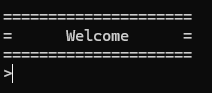
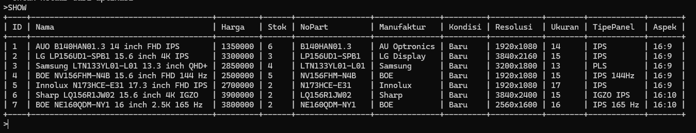
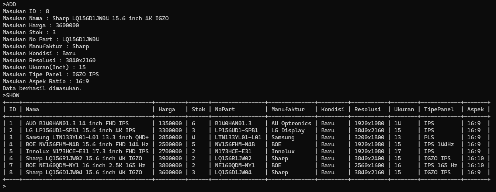
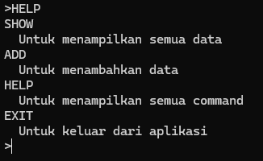
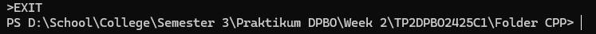
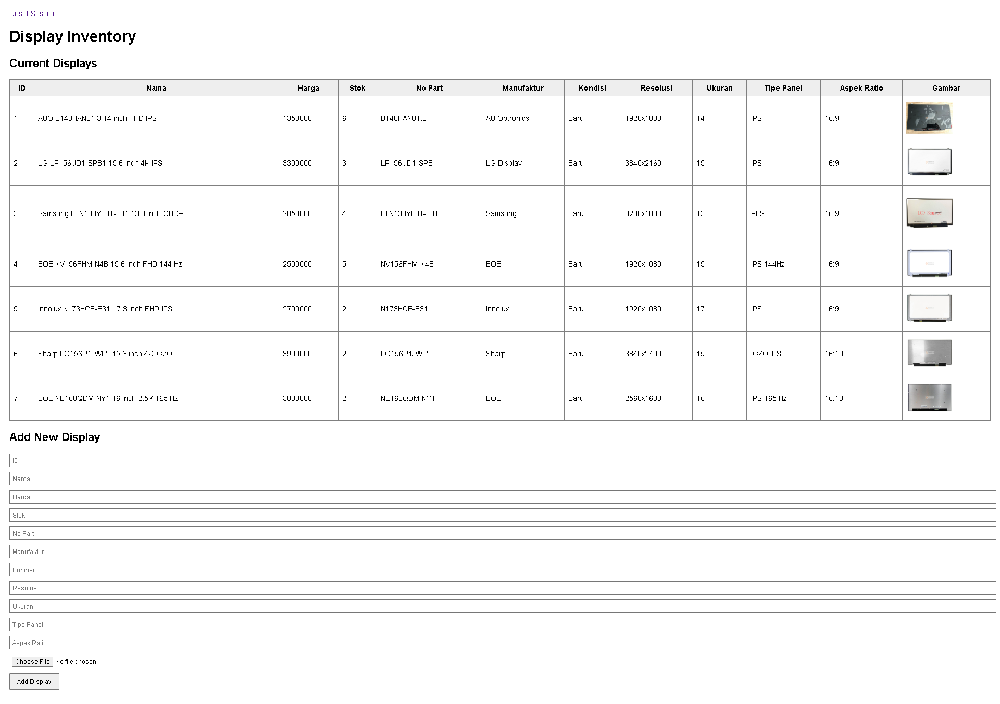
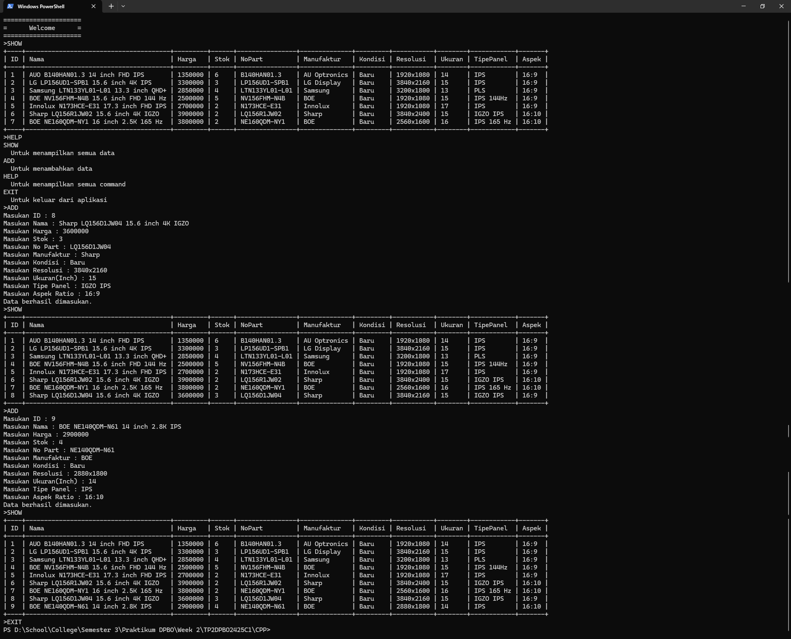
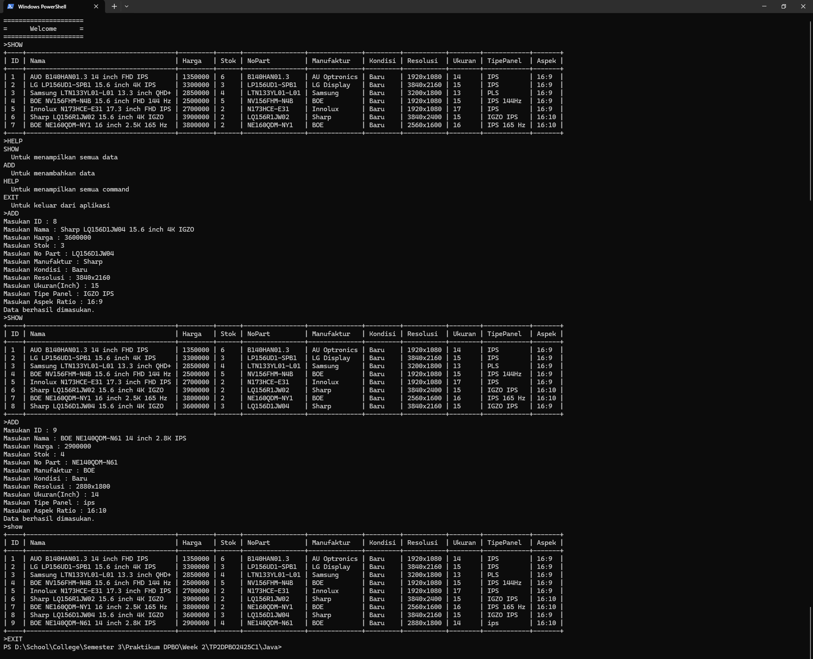

# Tugas Praktikum 2
## Janji
Saya Muhammad Attala Rafikasya dengan NIM 2403310 mengerjakan Tugas Praktikum 2 dalam mata kuliah Desain Pemrograman Berbasis Objek untuk keberkahanNya maka saya tidak melakukan kecurangan seperti yang telah dispesifikasikan.

Repository ini berisi implementasi dari konsep Object Oriented Programming (OOP) dalam 4 bahasa :
- C++
- Java
- Python
- PHP  

Berisi contoh implementasi konsep pewarisan (inheritance) dengan 3 tingkatan kelas beserta fitur untuk menambahkan data ke dalam list produk.

## Desain Program
Toko Elektronik Part Laptop

### 1. Barang
Sebagai kelas general untuk semua barang yang dijual.
Atribut Private :
- id
- nama
- harga
- stok
- foto (Hanya php)

Method :
- Get Set untuk semua private atribut  

### 2. PartLaptop
Sebagai kelas turunan dari Barang yang menambahkan atribut untuk part laptop.  
Atribut Private :
- no_part
- manufaktur
- kondisi

Method :
- Get Set untuk semua private atribut

### 3. Display
Sebagai kelas turunan dari PartLaptop khusus untuk part display dengan atribut khususnya.  
Atribut Private :
- resolusi
- ukuran
- tipe_panel
- aspek_ratio

Method :
- Get Set untuk semua private atribut

## Diagram

## Alur Program
### 1. Inisialisasi
Ketika program dijalankan, Data akan diisi oleh 6 display yang disimpan secara hardcode di dalam program.
### 2. Runtime
Program akan menapilkan pesan welcome dan akan menuggu input user.  
  
User dapat memasukan input :
- SHOW  
Untuk menampilkan semua data.
- ADD  
Untuk menambahkan data.
- HELP  
Untuk menampilkan semua command.
- Exit  
Untuk keluar dari aplikasi.

#### Jika user mengimput SHOW  
  
Program akan menampilkan semua data yang ada.

#### Jika user mengimput ADD
  
User akan diminta memasukan semua atribut kelas display, lalu akan dimasukan dalam data.

#### Jika user mengimput HELP  
  
Program akan menampilkan semua perintah yang dapat dilakukan

#### Jika user mengimput EXIT
  
Program akan berakhir.

Untuk PHP, semua data akan disajikan dalam bentuk tabel dan user dapat mengimput data baru dengan mengisi form input yang ada di bawah  

## Dokumentasi
### C++

### Java

### Python

### PHP

