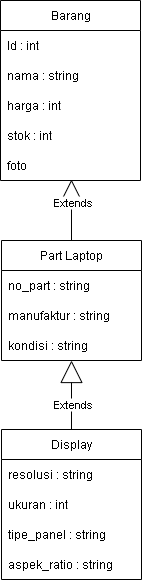

# Tugas Praktikum 2
## Janji
Saya Muhammad Attala Rafikasya dengan NIM 2403310 mengerjakan Tugas Praktikum 2 dalam mata kuliah Desain Pemrograman Berbasis Objek untuk keberkahanNya maka saya tidak melakukan kecurangan seperti yang telah dispesifikasikan.

## Desain Program
Toko Elektronik Part Laptop

1. Barang
Sebagai kelas general untuk semua barang yang dijual.
Atribut Private :
- id
- nama
- harga
- stok
- foto (Hanya php)

Method :
- Get Set untuk semua private atribut

2. PartLaptop
Sebagai kelas turunan dari Barang yang menambahkan atribut untuk part laptop.  
Atribut Private :
- no_part
- manufaktur
- kondisi

Method :
- Get Set untuk semua private atribut

3. Display
Sebagai kelas turunan dari PartLaptop khusus untuk part display dengan atribut khususnya.  
Atribut Private :
- resolusi
- ukuran
- tipe_panel
- aspek_ratio

Method :
- Get Set untuk semua private atribut

## Diagram

